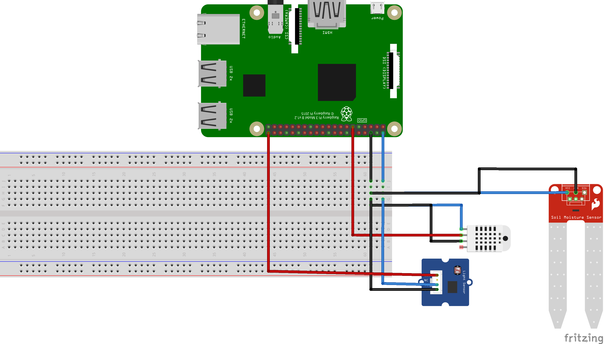

# Backend

## Requisitos

`sudo apt install -y python3-picamera2`
`pip3 install -r requirements.txt`

## Ejecución

Ejecutar desde src/ :
`python3 main.py`

## Rutas

/data: Obtiene info de temperatura/humedad
/data/historiacl: Obtiene el historial de datos de la base de datos
/control: Controla los parámetros para regar, etc

## Conexiones raspberry

- 3 Relays:4, 17, 27
- 2 Sensores humedad:22, 24
- 1 Sensor temperatura y humedad ambiental: 18
- 1 Sensor de luz: 23
